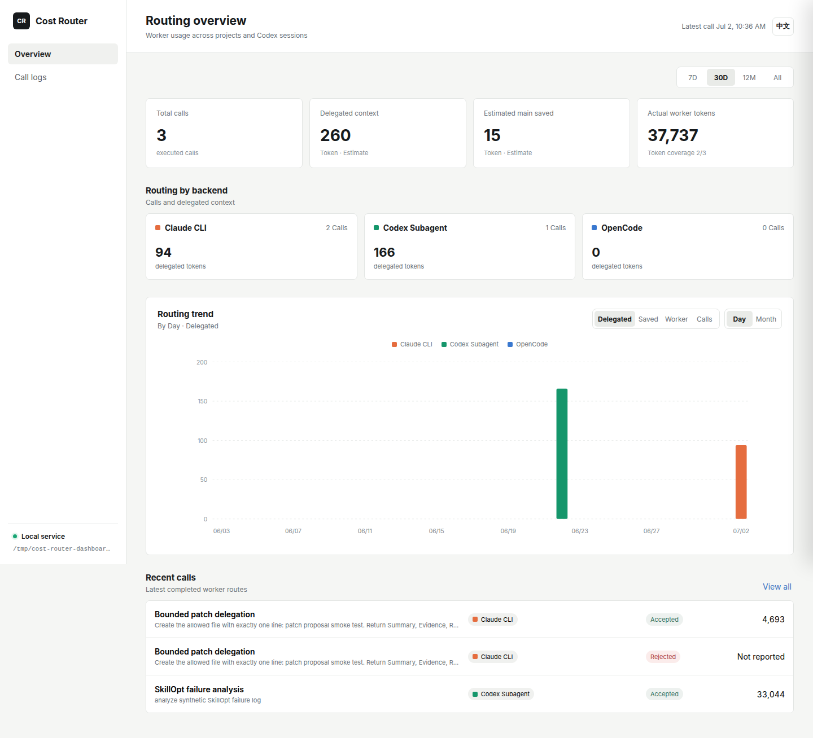
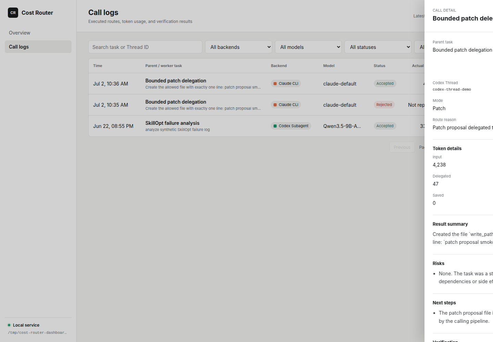
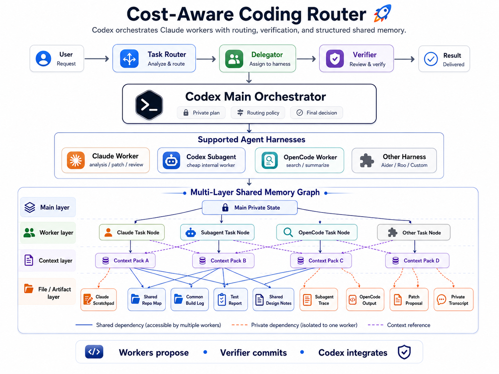

# Cost Router

[English](README.md) | [简体中文](README_zh.md)

<p align="center"><strong>Route long coding tasks across agent harnesses without losing control of context, files, or verification.</strong></p>

<p align="center">
  
  
  
  
</p>

A cost-aware coding-agent router for delegating bounded work from a main Codex
session to lower-cost or differently specialized workers.

> [!IMPORTANT]
> **Cost Router is experimental.** Claude CLI delegation, read-only Codex
> subagents, bounded patch proposals, shared-memory persistence, and the local
> dashboard work today. Generic asynchronous workloads can also be monitored by
> a resumable Claude session and returned to Codex on significant or terminal
> events. Automatic decomposition, scheduling, and fallback remain roadmap items.

## Project Status

| Capability | Status | Current behavior |
|---|---|---|
| Claude CLI worker | **Working** | Read-only analysis and isolated patch proposals |
| Codex subagent | **Working** | Responses-compatible, read-only delegated work |
| Write isolation | **Working** | Staged workspace, explicit write allowlist, patch output |
| Token ledger and dashboard | **Working** | Global SQLite ledger, usage charts, call details |
| Shared memory graph | **Prototype** | Control, worker, context, artifact, event, and lock records |
| Async worker runtime | **Prototype** | Detached workload, resumable Claude checks, terminal Codex callback |
| Task decomposition | **In progress** | Main Codex + Skill currently perform decomposition |
| Automatic routing and fallback | **Planned** | Backend selection is still explicit |
| OpenCode / other harnesses | **Planned** | Dashboard schema is ready; runtime adapter is not |

## Dashboard

Track delegated context, estimated main-agent savings, actual worker usage, and
backend distribution across projects and Codex sessions.



Inspect each call's parent task, worker task, model, verification result, token
breakdown, raw output, and proposed patch.



## Asynchronous Tasks

`async-task` is a generic runtime primitive, not a training-specific command. It
can own any long-running workload, periodically send bounded log snapshots to the
same Claude session, persist events in SQLite, and resume the originating Codex
thread only when attention is needed or the workload reaches a terminal state.

```bash
cost-router async-task start \
  --goal "Monitor this long job and return actionable failures or completion" \
  --command "bash scripts/run_job.sh --config configs/job.yaml" \
  --log-path outputs/progress.log \
  --interval 60
```

When started from Codex, `CODEX_THREAD_ID` is captured automatically and the
default callback is `codex exec resume`. Normal completion, failure,
cancellation, and timeout all produce terminal events. Periodic healthy checks
do not wake Codex.

```bash
cost-router async-task status async_123456789abc
cost-router async-task events async_123456789abc
cost-router async-task stop async_123456789abc
cost-router async-task retry-callbacks async_123456789abc
```

The deterministic Python controller decides process exit, marker files, timeout,
and cancellation. Claude analyzes snapshots but cannot override those facts. The
current runtime does not yet recover an active workload after the controller
process or machine restarts.

## Target Architecture



The system follows a three-stage pipeline — **Task Router → Delegator → Verifier** — orchestrated by a Codex main session. Workers propose patches and facts; the verifier commits only validated results into the shared memory graph.

**Harness direction:**

| Harness | Role | Status |
|---|---|---|
| Claude Worker | analysis / patch / review | Working |
| Codex Subagent | lower-cost internal worker | Read-only working |
| OpenCode Worker | search / summarize / alternate harness | Planned |
| Other (Aider, Roo, Custom) | adapter-based extension | Research |

**Multi-layer shared memory graph** (4 layers):

- **Main layer** — Main Private State: routing policy, private plan, final decisions.
- **Worker layer** — one Task Node per harness (Claude, Subagent, OpenCode, Other).
- **Context layer** — Context Packs A–D: read-only background material the main agent assigns to each worker.
- **File / Artifact layer** — shared artifacts (repo map, build log, test report, design notes) and private artifacts (scratchpad, trace, patch proposal, transcript).

Dependency types: **solid** = shared across workers, **dashed** = private to one worker, **dotted** = context reference.

Core invariant: **Workers propose → Verifier commits → Codex integrates.**

## Roadmap

**Router and orchestration**

- [ ] Turn Skill-level decomposition into a persisted parent-task DAG.
- [ ] Add dependency-aware parallel and sequential worker scheduling.
- [ ] Route by task difficulty, risk, context size, model capability, and policy.
- [ ] Add retry budgets, fallback chains, and controller restart recovery.

**Shared memory and files**

- [ ] Complete worker context refresh for long-running tasks.
- [ ] Enforce concurrent file leases and conflict-aware patch merging.
- [ ] Add compact task summaries with drill-down context and artifacts.
- [ ] Evaluate retrieval and memory policies against long-horizon coding tasks.

**Verification and safety**

- [ ] Add pluggable test, lint, type-check, and patch-applicability verifiers.
- [ ] Introduce confidence scoring and verifier-driven rework loops.
- [ ] Add authenticated remote dashboard access and privacy controls.

**Harness ecosystem**

- [ ] Implement the OpenCode adapter and cross-harness context contract.
- [ ] Add writable Codex subagents with the same bounded-patch policy.
- [ ] Define an adapter SDK for Aider, Roo, custom CLIs, and MCP delegators.
- [ ] Package the project as a versioned Codex plugin for easier distribution.

## Quick Start

### Prerequisites

- Python 3.11+
- At least one implemented worker backend configured (Codex subagent or Claude CLI)

### Install

```bash
python3 -m pip install -e .
cost-router setup
```

`setup` creates the personal ledger at `$XDG_DATA_HOME/cost-router/memory.sqlite3`
(or `~/.local/share/cost-router/memory.sqlite3`) and installs the skill at
`$HOME/.agents/skills/cost-router`. It prints the exact writable root to add to
`~/.codex/config.toml`; add it and restart Codex so every project can write to
the shared ledger without repeated approval prompts.

### Codex setup

```bash
codex login
codex login status
```

### Claude CLI setup

```bash
npm install -g @anthropic-ai/claude-code
claude auth login
claude auth status
```

### Personal Codex skill

```bash
cost-router setup
```

This is a user-level registration, so the skill is available from every Codex
session and project. Existing installations are kept; run `cost-router setup
--force` to update the installed copy.

### Use in Codex

Restart Codex, verify the skill appears in `/skills`, then use it directly in a Codex chat:

```text
$cost-router Investigate this long coding task, delegate suitable exploratory work, then implement and verify the result.
```

Codex may also select the skill implicitly for decomposable, context-heavy coding work. Explicit invocation is preferable while the workflow is being tested.

### Open the dashboard

```bash
cost-router dashboard
```

The local console opens at `http://127.0.0.1:8765`. It summarizes calls and
delegated tokens across Codex sessions and repositories, and includes a
filterable call log. Use `--no-open` to start without opening a browser or
`--port PORT` to select another port.

For a remote development server, prefer IDE/SSH port forwarding. To expose the
console on the server network explicitly, use `cost-router dashboard --host
0.0.0.0`; the dashboard has no authentication, so do not expose it to an
untrusted network.

## CLI Reference

The Python CLI is for development, testing, and debugging. In normal use, invoke the skill inside Codex as shown in Quick Start above.

### Dry Run

Generate the route decision without invoking any backend:

```bash
python3 -m cost_router run \
  --env-file /path/to/provider.env \
  --goal "analyze synthetic SkillOpt failure log" \
  --path experiments/sample-skillopt-run.log \
  --json
```

The env file should define:

```bash
QWEN_CHAT_BASE_URL=...
QWEN_CHAT_MODEL=...
QWEN_CHAT_API_KEY=...
```

Claude CLI dry-run:

```bash
python3 -m cost_router run \
  --backend claude-cli \
  --claude-model sonnet \
  --goal "analyze synthetic SkillOpt failure log" \
  --path experiments/sample-skillopt-run.log \
  --json
```

With a context pack:

```bash
python3 -m cost_router run \
  --backend claude-cli \
  --claude-model sonnet \
  --goal "review the implementation against the memory design" \
  --context-pack docs/memory.md \
  --path cost_router/memory.py \
  --execute
```

### Execute

```bash
python3 -m cost_router run \
  --env-file /path/to/provider.env \
  --goal "analyze synthetic SkillOpt failure log" \
  --path experiments/sample-skillopt-run.log \
  --execute
```

Claude CLI execution uses `claude -p --output-format json` by default:

```bash
python3 -m cost_router run \
  --backend claude-cli \
  --claude-command claude \
  --goal "analyze synthetic SkillOpt failure log" \
  --path experiments/sample-skillopt-run.log \
  --execute
```

### Bounded Patch Proposal

Use patch mode when a worker may edit a small, explicit file set:

```bash
cost-router run \
  --backend claude-cli \
  --mode patch \
  --parent-task-label "Router validation improvements" \
  --goal "add validation for empty task goals" \
  --repo . \
  --path cost_router/schemas.py \
  --write-path cost_router/router.py \
  --write-path tests/test_core.py \
  --execute \
  --json
```

`--path` inputs are read-only. `--write-path` entries form the complete write allowlist. The worker receives `Edit/Write` tools only inside that run. Cost Router compares the workspace with its baseline, rejects out-of-scope changes, and emits `proposed.patch`; it never applies the patch automatically.

### Inspect Memory

Route decisions, subtask results, verification status, and verified facts are stored in the personal SQLite ledger:

```bash
python3 -m cost_router memory --json
```

All commands use the global ledger by default. Set `COST_ROUTER_MEMORY` or use
`--memory /path/to/memory.sqlite3` to inspect a specific ledger, including a
legacy project ledger such as `.cost-router/memory.sqlite3`.

## Token Ledger

The token ledger is not a dollar-cost calculator. It tracks:

| Field | Description |
|---|---|
| `actual_worker_tokens` | token usage reported by the worker CLI when available |
| `delegated_context_tokens_estimate` | approximate tokens in the task goal and paths sent to the worker |
| `returned_result_tokens_estimate` | approximate tokens the main agent receives back |
| `estimated_main_tokens_saved` | delegated context minus returned result |

The dashboard reports actual-token coverage separately. A worker call that
does not report usage is shown as **Not reported**, never as zero. Each call
also records `CODEX_THREAD_ID` when available and the Skill supplies a shared
`parent_task_label` for calls derived from the same user task.

Estimates use file byte size / 4 as a rough token proxy. Very small tasks may report `estimated_main_tokens_saved=0` when the worker summary is longer than the delegated input.

> **Privacy:** Do not send private source code, credentials, or logs to an external provider unless that data transfer is approved.
