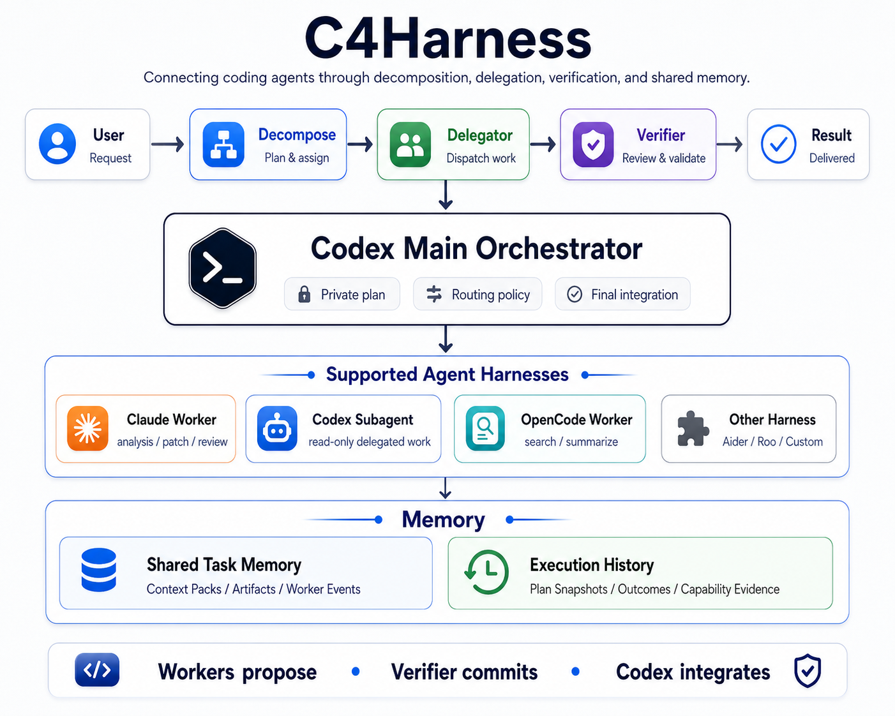
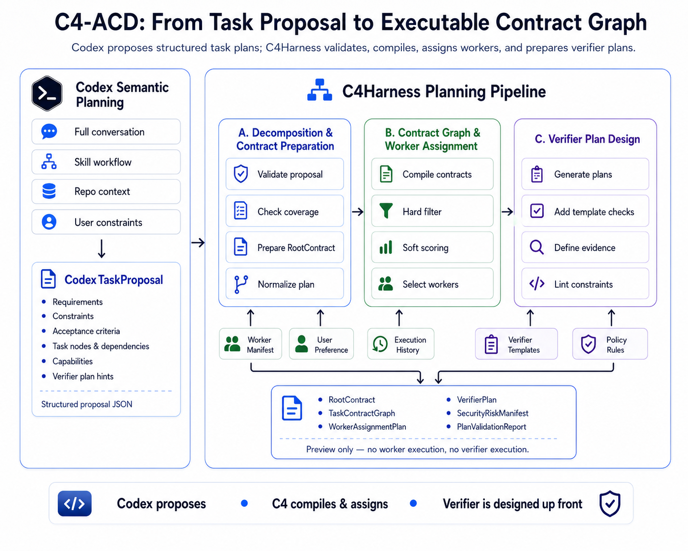
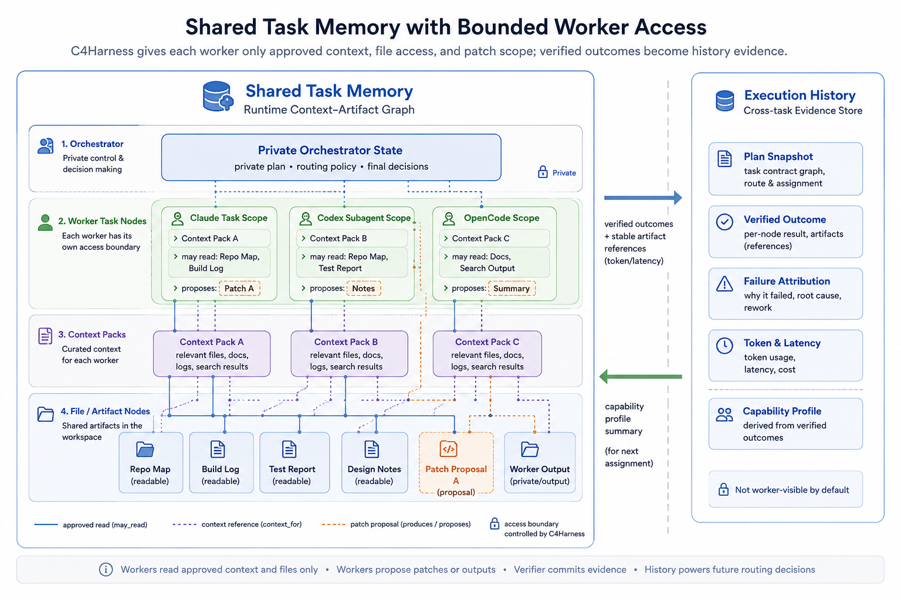

<p align="center">
  
  <br>
  <strong style="font-size: 2em;">C4Harness</strong>
</p>

<p align="center"><em>C4 = Codex · Connect · Claude · Cost-router</em></p>

---

<p align="center"><strong>链接Agent，编排协作，路由降本。</strong></p>

<p align="center"><a href="README.md">English</a> | <a href="README_zh.md">简体中文</a></p>

<p align="center">
  
  
  
  
</p>

C4Harness 是一个面向多 coding-agent 协作的编排系统，用于从主 Codex 会话中拆解、委托、验证并沉淀受限任务，让不同成本和不同能力的 worker 在可控上下文与文件权限下协同工作。

> [!IMPORTANT]
> **C4Harness 仍处于实验阶段。** Claude CLI 委托、只读 Codex subagent、
> 受限 patch 提案、共享 memory 持久化和本地控制台已经可用；通用异步
> workload 也可以由可恢复的 Claude session 持续检查，并在重要事件或终态时
> 写入持久 C4 Inbox，并由 Dashboard 提醒用户。可解释的任务拆解预览现已可用；任务图执行、自动调度和
> fallback 仍在 Roadmap 中。

## 项目状态

| 能力 | 状态 | 当前行为 |
|---|---|---|
| Claude CLI worker | **可用** | 只读分析与隔离的 patch 提案 |
| Codex subagent | **可用** | 兼容 Responses API 的只读委托 |
| 写入隔离 | **可用** | Staged workspace、写入白名单、patch 输出 |
| Token 账本与 Dashboard | **可用** | 全局 SQLite、用量图表、调用详情 |
| 共享 Memory 图 | **原型** | Control、worker、context、artifact、event 与 lock 记录 |
| 异步 Worker Runtime | **原型** | 后台 workload、Claude 可恢复检查、持久 Inbox 通知 |
| 任务拆解 | **原型** | 契约图预览、能力分配、置信度、风险清单与历史快照 |
| 自动路由与 fallback | **计划中** | 当前仍需显式选择 backend |
| OpenCode 与其他 harness | **计划中** | Dashboard schema 已预留，runtime adapter 尚未实现 |

## 目标架构

C4Harness 围绕四个核心模块组织：**Decompose**、**Delegator**、**Verifier** 和 **Memory**。主 Codex 会话保留私有编排权；C4Harness 将主会话中的结构化计划编译为受限的 worker assignment，将任务分发给不同 harness，验证 worker 返回的证据，并将可复用的执行历史沉淀为后续路由依据。



整体流程可以理解为：

1. **Decompose**：将 Codex 生成的结构化任务方案编译为可执行、可验证、可分配的 contract graph。
2. **Delegator**：把已经分配好的 `TaskNodeContract` 和受限上下文交给指定 worker/harness。
3. **Verifier**：基于文件、artifact、patch、命令输出和 verifier plan 检查 worker 结果。
4. **Memory**：在一次任务内维护共享上下文与 artifact 图，并将验证后的 outcome 写入跨任务历史。

核心不变式是：

> **Workers propose → Verifier commits → Codex integrates.**

### 支持的 Agent Harnesses

| Harness | 角色 | 状态 |
|---|---|---|
| Claude Worker | analysis / patch / review | Working |
| Codex Subagent | read-only delegated work | Working |
| OpenCode Worker | search / summarize / alternate harness | Planned |
| Other Harness | Aider / Roo / Custom | Research |

### C4-ACD 规划流程

C4-ACD 不只是简单的 prompt 拆分，而是把 Codex 的语义规划转化为一个可以执行、可以验证、可以分配 worker 的契约式任务图。



第一版设计中，Codex 负责理解完整对话、Skill workflow、仓库上下文和用户约束，并输出结构化的 `CodexTaskProposal`。C4Harness 不额外调用一套 planning LLM，而是对 proposal 做确定性编译和分配：

1. **Decomposition & Contract Preparation**：校验 proposal、检查 requirement coverage、准备 RootContract，并规范化单节点或任务图路径。
2. **Contract Graph & Worker Assignment**：编译 `TaskNodeContract`，根据 hard capabilities 过滤 worker，再结合 soft score、用户偏好和历史证据选择主 worker 与 fallback。
3. **Verifier Plan Design**：生成节点级 verifier plan，补充模板检查、证据要求和路径/权限约束。

最终输出是 `DecompositionPlan`，包括 `RootContract`、`TaskContractGraph`、`WorkerAssignmentPlan`、`VerifierPlan`、`SecurityRiskManifest` 和 `PlanValidationReport`。Decompose 阶段只生成计划，不执行 worker，也不运行 verifier。

### Memory 设计

C4Harness 将一次任务内的协作 memory 和跨任务的历史证据分开管理。



**Shared Task Memory** 是当前任务的 runtime context-artifact graph。它负责描述 worker 能看到什么、能读取哪些文件、能提交哪些 artifact 或 patch proposal。每个 worker 只读取被批准的 task node、context pack 和 file/artifact，不能直接写入 shared facts，也不能直接修改真实仓库文件。

**Execution History** 是跨任务的 append-only 记录，用于保存 plan snapshot、verified outcome、failure attribution、token/latency 和 capability profile。它默认不对 worker 可见，只向后续 Decompose 阶段提供受控的 capability evidence summary。

这种拆分让当前任务协作保持最小可见性，同时允许系统基于历史验证结果做更好的 worker assignment。

## Dashboard

跨项目和 Codex 会话查看委托上下文、预估主模型节省、实际 worker Token 与
backend 分布。


查看每次调用的主任务、worker 子任务、模型、验证结果、Token 明细、原始
输出和 patch 提案。


Dashboard 同时也是异步工作的通知界面：首页突出未读终态结果和运行中任务，
“异步任务”页面按来源 Codex 对话分组，并允许用户将结果标记为已处理。

## 快速开始

### 环境要求

- Python 3.11+
- 至少配置一个已经实现的 worker 后端（Codex subagent 或 Claude CLI）

### 安装

```bash
git clone https://github.com/sam234990/c4harness.git
cd c4harness
python3 -m pip install -e .
cost-router setup
```

`setup` 会在 `$XDG_DATA_HOME/cost-router/memory.sqlite3`（未设置时为
`~/.local/share/cost-router/memory.sqlite3`）创建个人全局账本，并将 Skill
安装到 `$HOME/.agents/skills/cost-router`。命令会输出需要加入
`~/.codex/config.toml` 的准确 writable root；添加后重启 Codex，各项目便可
直接写入共享账本，不必反复申请额外权限。

### Codex 配置

```bash
codex login
codex login status
```

### Claude CLI 配置

```bash
npm install -g @anthropic-ai/claude-code
claude auth login
claude auth status
```

### 注册个人级 Codex Skill

```bash
cost-router setup
```

这是 USER 级注册，因此所有 Codex 会话和项目都能使用该 Skill。已存在的
安装默认保留；使用 `cost-router setup --force` 更新安装副本。

### 在 Codex 中使用

重启 Codex，确认 skill 出现在 `/skills` 中，然后在 Codex 对话中直接使用：

```text
$cost-router Investigate this long coding task, delegate suitable exploratory work, then implement and verify the result.
```

Codex 也可能为可拆分的、上下文密集的编码任务自动选择该 skill。调试阶段建议显式调用。

### 外部 Worker 策略

C4Harness 将用户授权与宿主强制策略分成两层：

| 策略 | 行为 |
|---|---|
| `never` | 不执行任何外部 worker |
| `ask` | 允许公开或合成数据；私有数据需要明确授权 |
| `allow` | 记录用户已经明确授权本次边界明确的外部传输 |

仓库输入默认标记为 `private`。当用户明确要求 Codex 使用 Claude 处理指定
仓库文件时，Skill 会传入 `--external-policy allow --data-classification
private`，不会把用户的明确要求误判为“尚未授权”。

在重新尝试一个被阻止或可能涉及敏感内容的外部委托前，已安装的 Skill 要求
Codex 先向用户汇总本次任务的安全风险。根据任务情况，风险说明应包括：

- 哪些源码、日志、Context Pack 或生成的 artifact 可能离开本地环境；
- 哪个外部 Provider 和模型会接收这些内容；
- Worker 是否获得读取、Shell、网络或 staged write 权限；
- 是否可能暴露凭据、个人数据、专有代码或无关仓库内容；
- 写入白名单、预期输出、Inbox 行为，以及错误或受攻击 Worker 的影响范围。

随后 Codex 应等待用户明确确认。确认后，只能针对同一个边界明确的操作，使用
`allow/private` 和已批准的路径、权限重试一次；不得静默扩大传输范围、更换
Provider，或在第二次被拒后尝试绕过策略。

> [!WARNING]
> **即使用户已经确认，Codex 仍可能拒绝执行。** `allow` 只记录用户在
> C4Harness 中的授权，不能覆盖 Codex 沙箱、命令审批、组织策略、Secret
> 检测或数据外发管控。宿主策略阻断应被如实报告，也不能计为 Worker 能力失败。

> [!CAUTION]
> **Full Access（完全访问权限）只是可选的高风险排障方式。** 用户充分理解
> 后果后，可以尝试以 Full Access 运行 Codex，以减少文件系统、网络或命令审批
> 造成的阻碍。但这会让 Codex 及其调用的工具获得更广泛的机器与仓库访问权：
> 仅应在可信工作区使用，确认准确的传输边界，排除凭据和无关文件，并优先采用
> 一次性隔离环境。Full Access 仍不保证绕过独立的组织或数据外发策略。

### 预览任务拆解

`decompose` 会构建任务情境、根契约、fast/graph 决策、基于能力的 Worker
分配、VerifierPlan 与安全风险清单。它只做预览，不会调用 Worker 或执行任务图。

```bash
cost-router decompose \
  --goal "审查并记录 parser 行为" \
  --requirement "检查 parser 行为" \
  --requirement "生成带证据的文档" \
  --constraint "不得修改源码" \
  --acceptance "所有必要行为均关联文件证据" \
  --active-skill review \
  --skill-step inspect \
  --skill-step document \
  --plan-mode \
  --json
```

Plan 与节点结果写入独立的 decomposition history，不与单次任务使用的 shared
context/artifact memory 图混合。Worker 能力来自
`~/.config/cost-router/workers.json`（或 `COST_ROUTER_WORKERS`），同一份配置可在
Dashboard 的 **Worker 配置** 页面编辑。

每个 Worker 会分别保存真实上游模型和 Harness 使用的 CLI alias。例如 Claude
Code 可以配置 `model=mimo-v2.5-pro`、`model_alias=opus`；C4Harness 会把
`opus` 传给 `claude --model`，再由 `ANTHROPIC_DEFAULT_OPUS_MODEL` 映射到
自定义模型。可以直接执行指定配置：

```bash
cost-router run --worker-id claude-mimo-pro --goal "审查这个模块" --path src/ --json
```

Worker 页面使用复选框、开关、下拉框和上下文上限展示 Hard Capability，使用
0–1 滑块展示 Soft Capability。Backend/adapter 根据 Harness 自动推导，不再要求
用户重复填写。

### 打开统计控制台

```bash
cost-router dashboard
```

本地控制台默认打开 `http://127.0.0.1:8765`，汇总不同 Codex 会话和项目的
调用次数、分流 Token，并提供可筛选的调用日志。使用 `--no-open` 可禁止
自动打开浏览器，使用 `--port PORT` 可指定其他端口。

在远程开发服务器上，建议优先使用 IDE/SSH 端口转发。如需明确监听服务器
网络接口，可运行 `cost-router dashboard --host 0.0.0.0`。Dashboard 没有
身份验证，不要将该端口暴露到不可信网络。

## CLI 参考

Python CLI 用于开发、测试和调试。正常使用请在 Codex 中调用 skill，见上方快速开始。

### Dry Run

仅生成路由决策，不调用任何后端：

```bash
python3 -m cost_router run \
  --env-file /path/to/provider.env \
  --goal "analyze synthetic SkillOpt failure log" \
  --path experiments/sample-skillopt-run.log \
  --json
```

env 文件需定义：

```bash
QWEN_CHAT_BASE_URL=...
QWEN_CHAT_MODEL=...
QWEN_CHAT_API_KEY=...
```

Claude CLI dry-run：

```bash
python3 -m cost_router run \
  --backend claude-cli \
  --claude-model sonnet \
  --goal "analyze synthetic SkillOpt failure log" \
  --path experiments/sample-skillopt-run.log \
  --json
```

带 context pack：

```bash
python3 -m cost_router run \
  --backend claude-cli \
  --claude-model sonnet \
  --external-policy allow \
  --data-classification private \
  --goal "review the implementation against the memory design" \
  --context-pack docs/memory.md \
  --path cost_router/memory.py \
  --execute
```

### 执行

```bash
python3 -m cost_router run \
  --env-file /path/to/provider.env \
  --goal "analyze synthetic SkillOpt failure log" \
  --path experiments/sample-skillopt-run.log \
  --execute
```

Claude CLI 默认使用 `claude -p --output-format json`：

```bash
python3 -m cost_router run \
  --backend claude-cli \
  --claude-command claude \
  --data-classification synthetic \
  --goal "analyze synthetic SkillOpt failure log" \
  --path experiments/sample-skillopt-run.log \
  --execute
```

### 异步任务

`async-task` 是长时间 workload 的一种可选 runtime 模式，不是普通委托的
必经流程，也不是训练专用命令。它可以托管 workload，定期把有限的日志快照
在发生变化时交给同一个可恢复的 Claude session，并把重要事件或终态写入持久
Codex Inbox。

```bash
cost-router async-task start \
  --external-policy allow \
  --data-classification private \
  --goal "持续检查长任务，在失败或完成时返回可执行结论" \
  --command "bash scripts/run_job.sh --config configs/job.yaml" \
  --log-path outputs/progress.log \
  --interval 60
```

异步事件只写入本地持久 Inbox。正常完成、失败、取消、超时和请求输入
会在本地排队，无需启动新的 Codex 模型 turn 即可查看和确认。Python runtime
会先比较文件大小与修改时间；日志没有变化时不调用 Claude，连续空闲检查采用
有上限的指数退避。

```bash
cost-router async-task status async_123456789abc
cost-router async-task events async_123456789abc
cost-router async-task inbox --unread-only
cost-router async-task ack 42
cost-router async-task stop async_123456789abc
```

Codex 当前没有公开接口，允许外部 Worker 唤醒当前可见的 IDE 对话并确认送达。
因此 C4Harness 不再启动第二个 `codex exec resume` 进程。结果会保持未读状态，
直到用户让 Codex 检查 Inbox，或在 Dashboard 中将其标记为已处理。

普通 Python runtime process 负责定时调度，并判断进程退出、marker 文件、
超时与取消；它本身不消耗模型 Token。Claude 只分析快照，不能覆盖这些确定性
事实。

### Bounded Patch Proposal

当 worker 需要编辑少量明确文件时，使用 patch 模式：

```bash
cost-router run \
  --backend claude-cli \
  --external-policy allow \
  --data-classification private \
  --mode patch \
  --parent-task-label "改进 Router 验证机制" \
  --goal "add validation for empty task goals" \
  --repo . \
  --path cost_router/schemas.py \
  --write-path cost_router/router.py \
  --write-path tests/test_core.py \
  --execute \
  --json
```

`--path` 为只读输入。`--write-path` 构成完整的写入白名单。Worker 仅在该次运行中获得 `Edit/Write` 工具。Cost Router 将工作区与基线对比，拒绝越界变更，输出 `proposed.patch`；不会自动应用 patch。

### 查看 Memory

路由决策、子任务结果、验证状态和已验证事实存储在个人全局 SQLite 账本中：

```bash
python3 -m cost_router memory --json
```

所有命令默认使用全局账本。可以通过 `COST_ROUTER_MEMORY` 或
`--memory /path/to/memory.sqlite3` 指定其他账本，也可以查看旧版本留下的
项目账本，例如 `.cost-router/memory.sqlite3`。

## Token Ledger

Token ledger 不是美元成本计算器，它记录：

| 字段 | 说明 |
|---|---|
| `actual_worker_tokens` | worker CLI 报告的 token 用量（如可用） |
| `delegated_context_tokens_estimate` | 发送给 worker 的 task goal 和 path 的近似 token 数 |
| `returned_result_tokens_estimate` | 主 agent 收回的近似 token 数 |
| `estimated_main_tokens_saved` | 委托上下文减去返回结果 |

控制台会单独显示实际 Token 的覆盖率。Worker 未报告 usage 时显示为
**未报告**，不会按 0 处理。每次调用还会在可用时自动记录
`CODEX_THREAD_ID`，Skill 则为同一用户任务拆出的调用传入统一的
`parent_task_label`。

估算使用文件字节数 / 4 作为粗略 token 代理。极小任务可能因 worker 摘要长于委托输入而报告 `estimated_main_tokens_saved=0`。

> **隐私提示：** 除非已确认可接受，否则不要将私有源码、凭据或日志发送给外部 provider。

## Roadmap

**Router 与编排**

- [x] 预览并持久化可解释的任务契约图，但暂不执行任务图。
- [ ] 实现依赖感知的并行与串行 worker 调度。
- [ ] 根据难度、风险、上下文规模、模型能力和策略自动路由。
- [ ] 加入重试预算、fallback 链与 Inbox 保留/提醒策略。

**共享 Memory 与文件**

- [ ] 完成长任务运行期间的 worker 上下文补充机制。
- [ ] 强制执行并发文件 lease 与冲突感知的 patch 合并。
- [ ] 实现可逐层下钻的任务摘要、完整上下文和 artifact。
- [ ] 在长周期编码任务中评估 retrieval 与 memory policy。

**验证与安全**

- [ ] 加入可插拔的测试、lint、类型检查和 patch 可应用性 verifier。
- [ ] 引入置信度评分与 verifier 驱动的返工循环。
- [ ] 为远程 Dashboard 加入身份验证和隐私控制。

**Harness 生态**

- [ ] 自动检测已安装的 harness、模型别名、实际工具、模态、上下文限制与联网策略，并生成待用户确认的 Worker 配置建议。
- [ ] 区分模型声明能力与 harness/C4 策略实际交付的能力，并通过安全探测进行验证。
- [ ] 实现 OpenCode adapter 与跨 harness 上下文契约。
- [ ] 为 Codex subagent 加入同样受限的可写 patch 模式。
- [ ] 为 Aider、Roo、自定义 CLI 和 MCP delegator 定义 Adapter SDK。
- [ ] 打包为带版本的 Codex Plugin，简化开源分发与安装。
