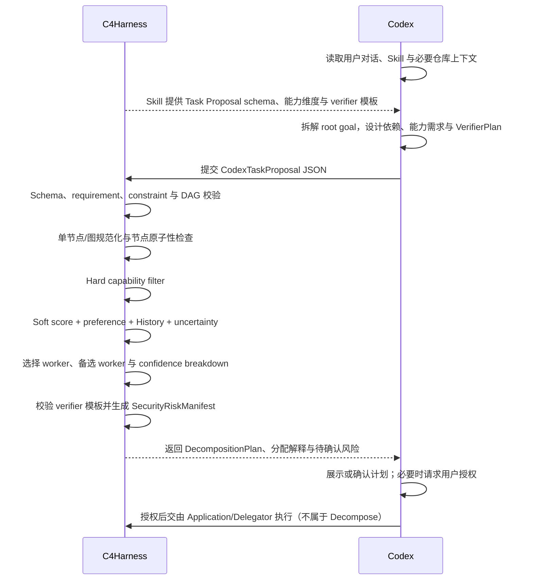

# C4 Task Decomposition and Assignment Method

**Status**: method design draft

**Date**: 2026-07-07

**Scope**: Codex 生成语义任务方案，C4Harness 校验任务契约、分配 worker、生成风险清单并读取历史能力证据

本文定义 C4Harness 的默认任务拆解与分配方法。最新设计不要求 C4Harness 再配置或调用一套独立 LLM API。依赖完整对话、Skill 和仓库上下文的语义工作由当前主 harness（第一版为 Codex）完成；C4Harness 只处理结构化计划，并用确定性方法把它编译成可执行、可分配、可验证的任务契约图。

这套方法仍称为 **C4-ACD（Adaptive Contract Decomposition，自适应契约式拆解）**，但“Decomposition”不再意味着 C4 自己理解原始自然语言并调用模型切分任务，而是：

```text
Codex semantic planning
  -> C4 contract compilation
  -> capability-aware assignment
```

## 1. 模块定位与设计目标

### 1.1 为什么由 Codex 完成语义拆解

真实 coding task 的语义边界依赖：

- 用户完整对话，而不只是最后一句 prompt。
- 已触发 Skill 的流程、约束和验收要求。
- Codex 已经读取的仓库结构、代码、日志和环境信息。
- 当前处于普通执行、Plan Mode 还是已有计划的延续阶段。
- 用户刚刚确认的风险、偏好和禁止事项。

C4Harness 若重新截取这些上下文并调用另一套 LLM，既可能理解不完整，也会要求用户额外配置 API key、base URL 和 planning model。部分用户只有 Codex、Claude Code 等 coding-agent plan，并没有独立 LLM API。

因此第一版采用以下原则：

> **让拥有最多任务上下文的 Codex 生成结构化任务方案，让 C4Harness 负责确定性约束、能力匹配、历史评分和可解释分配。**

### 1.2 Codex 与 C4Harness 的职责

Codex 负责：

- 理解用户目标、Skill workflow 和已有仓库上下文。
- 提取 requirement、constraint、acceptance criterion。
- 提出一个或多个任务节点及其依赖关系。
- 为每个节点声明需要的 hard/soft capabilities，而不是点名具体 worker。
- 为每个节点设计可执行的 `VerifierPlan` 和必要的语义验收条件。
- 在 Plan Mode 中生成只读计划，不授予修改权限。

C4Harness 负责：

- 校验 Codex 输出是否满足 Task Proposal schema。
- 检查 requirement coverage、constraint preservation、依赖图合法性和节点原子性。
- 规范化单节点或多节点 Task Contract Graph。
- 根据 hard capabilities 排除不合格 worker。
- 根据 soft capabilities、用户偏好、历史验证结果、Token、延迟、风险和不确定性分配 worker。
- 校验并补充模板化 VerifierPlan。
- 为外部 assignment 生成 `SecurityRiskManifest` 与 consent scope。
- 保存 plan snapshot，并读取独立 Execution History 中的历史能力画像。

C4Harness 不负责：

- 调用额外 LLM API 理解原始 prompt。
- 在 Decompose 内启动 Claude、Codex、OpenCode 或其他 worker。
- 在 Decompose 内运行测试、应用 patch 或执行 Root Verification。
- 把 Task Contract Graph 混入单次任务的 Shared Memory Graph。
- 第一版中根据运行反馈自动修改正在执行的任务图。

这些运行职责分别属于 [delegator.md](delegator.md)、[verifier.md](verifier.md)、[memory.md](memory.md)、[history.md](history.md) 和 Application 层。

### 1.3 输入与输出

Codex 按 C4 Skill 提供的模板生成 `CodexTaskProposal`：

```text
CodexTaskProposal
  root_goal
  requirements[]
  constraints[]
  acceptance_criteria[]
  nodes[]
    objective
    requirement_refs[]
    dependencies[]
    context and path scope
    hard_capabilities
    soft_capability_weights
    verifier_plan
    root_contribution
  interaction_mode
  unresolved_questions[]
```

C4Harness 将其编译为：

```text
DecompositionPlan
  TaskSituationSummary
  RequirementLedger
  RootContract
  TaskContractGraph
  WorkerAssignmentPlan
  VerifierPlan per node
  SecurityRiskManifest per external assignment
  PlanValidationReport
```

### 1.4 核心原则

1. **语义理解留在主 harness**：不在 C4 内重复配置 planning LLM。
2. **结构化提案而非自由文本**：Codex 必须按稳定 schema 输出任务、能力和验证要求。
3. **Codex 描述能力，C4 选择 worker**：避免模型别名和历史能力变化污染任务语义。
4. **验证计划与节点同时生成**：没有 verifier 的节点不能直接进入可执行图。
5. **硬能力先过滤，软能力再评分**：不可用能力不能被低成本或偏好补偿。
6. **简单任务保持单节点**：C4 只做轻量判断，不重复“聪明地”拆解 Codex 的方案。
7. **历史证据独立保存**：跨任务 outcome 属于 Execution History，不属于 Shared Memory。
8. **选择过程可解释**：保留排除原因、评分分项、历史样本和不确定性。
9. **授权晚绑定**：只有 worker、provider、路径和操作明确后才生成完整风险摘要。
10. **宿主策略拥有最终决定权**：用户授权和 C4 风险清单不能绕过 Codex 或组织策略。

## 2. 核心流程与双方交互

下面的时序图中，左侧是 C4Harness，右侧是 Codex；执行顺序从上到下。



主流程可以压缩为：

```text
Codex understand and propose
  -> C4 validate and compile
  -> C4 assign workers
  -> C4 return explainable plan
```

### 2.1 与系统运行流程的关系

```text
CodexTaskProposal
  -> Decompose 编译并分配
  -> Application 保存 plan snapshot
  -> Policy Gate 获得必要授权
  -> Delegator 执行节点
  -> Verifier 执行节点 VerifierPlan
  -> Application 收口并执行 Root Verification
  -> History 记录 outcome
```

Decompose 到返回 `DecompositionPlan` 为止。worker 执行、验证结果、主任务验收和用户回复不属于本模块。

## 3. 方法细节

### 3.1 Codex Task Proposal

C4 Skill 应指导 Codex 在提交计划前完成最小充分理解：

1. 结合完整对话识别 root goal。
2. 读取已触发 Skill 的必要流程。
3. 使用 Codex 已掌握的仓库事实；只有关键未知量阻断计划时才继续调查。
4. 区分 deliverable、constraint、preference 与 acceptance criterion。
5. 生成任务节点、依赖、上下文范围和权限范围。
6. 为每个节点声明能力需求和 VerifierPlan。

Codex 不应直接选择 `mimo-v2.5`、`sonnet` 等具体 worker。它应声明：

```json
{
  "hard_capabilities": {
    "modalities": ["image", "text"],
    "tools": ["read", "patch"],
    "write_isolation": ["staged_copy"]
  },
  "soft_capability_weights": {
    "frontend_visual": 0.8,
    "code_implementation": 0.7,
    "debugging": 0.3
  }
}
```

三类入口的处理方式：

- **Skill 驱动任务**：Skill steps 是 workflow 约束，Codex 根据真实依赖决定节点，而不是机械地“一步一个 worker”。
- **长用户请求**：Codex 从完整语境提取交付物、约束和验收要求。
- **Plan Mode**：所有节点保持只读；即使 objective 提到修改，也不能产生写权限。

### 3.2 Root Contract 与 VerifierPlan 前置设计

Codex 在生成节点时同时提供 Root Contract 和节点级 VerifierPlan。C4 不使用额外 LLM 猜测“怎样才算完成”。

```text
Requirement
  id
  kind: deliverable | constraint | preference | acceptance
  text
  required

RootContract
  acceptance_criteria[]
  requirement_coverage
  global_tests[]
  prohibited_actions[]

VerifierPlan
  template_checks[]
  evidence_requirements[]
  semantic_criteria[]
  root_contribution
  inconclusive_policy
```

C4 对这些内容做确定性检查和补全：

- 每个 required requirement 必须被节点和 Root Contract 引用。
- constraint 不能被错误变成独立工作节点。
- patch 节点必须自动增加 write-scope 和 patch-exists 检查。
- 外部 worker 节点必须增加 consent-scope 检查。
- verifier 命令、路径和预期结果必须结构化、可授权和可执行。
- 语义检查可以保留给主 Codex 或独立 reviewer，但不能伪装成确定性检查。

第一版模板化 verifier 可以包括：

- `file_exists`
- `file_contains`
- `command_exit_zero`
- `output_matches`
- `tests_pass`
- `json_schema_valid`
- `changed_paths_within_allowlist`
- `patch_non_empty`
- `requirement_coverage`

Verifier 的执行算法、failure attribution 和 Root Verification 见 [verifier.md](verifier.md)。

### 3.3 单节点与任务图规范化

C4 不再根据原始自然语言计算复杂的 GraphBenefit，也不自行发明语义子任务。它只对 Codex 提案做简单判断：

- 只有一个原子节点时，规范化为 single-node fast path。
- 有多个节点或显式依赖时，规范化为 Task Contract Graph。
- 一个节点覆盖多个独立 required outcomes 时，返回 validation warning，要求 Codex 修订或明确接受。
- 多个节点没有真实依赖且合并成本更高时，提示可退回单节点。
- 缺少 verifier、没有合格 worker 或存在依赖环时，拒绝生成可执行计划。

因此 fast path 只是运行形态，不再是一套独立的语义拆解算法。

### 3.4 Contract Graph Compilation

Codex 提议的每个节点被编译为 `TaskNodeContract`：

```text
identity
  node_id
  kind: probe | work | verify | merge | decision | wait
  objective
  requirement_refs[]
  dependencies[]

context
  context_packs[]
  artifact_inputs[]
  allowed_paths[]

execution requirements
  execution_mode
  write_paths[]
  output_type
  hard_capabilities
  soft_capability_weights

verification design
  template_checks[]
  evidence_requirements[]
  semantic_criteria[]
  root_contribution

recovery metadata
  max_attempts
  fallback_classes[]
```

C4 编译阶段检查：

1. schema 与 capability dimension 是否已注册。
2. requirement 和 verifier 引用是否有效。
3. dependency graph 是否无环且不存在悬空节点。
4. path、write scope 和 Plan Mode 是否一致。
5. 节点是否至少存在一个满足 hard capabilities 的 worker。
6. root contribution 是否覆盖所有 required deliverables。

Task Contract Graph 只描述任务计划和依赖，不等同于 [memory.md](memory.md) 的 Shared Context-Artifact Graph。前者是跨任务可保存的计划快照；后者是一次执行期间向 worker 提供上下文和 artifact 的运行视图。

### 3.5 Capability-Aware Worker Assignment

#### WorkerArm

```text
WorkerArm
  backend and harness
  model alias and resolved model
  policy profile
  hard capability manifest
  declared soft capabilities
  historical capability evidence
  current availability
```

同一个模型在不同 harness 下应视为不同 WorkerArm，因为工具、session、memory、patch 和 sandbox 能力可能不同。

#### Hard Capability Filter

任一必要条件不满足就排除，不能用低成本或软能力补偿：

- modalities：text、image、audio 等。
- tools：read、grep、terminal、browser、patch、test。
- write isolation：staged copy、worktree 或 direct workspace。
- network、structured output 和 provider protocol。
- context window 与 persistent session。
- async monitor、privacy zone、外发策略和宿主限制。

#### Soft Capability Dimensions

第一版维度保持少量且可解释：

- code implementation
- debugging and root-cause analysis
- frontend and visual work
- documentation and research
- architecture and planning
- long-context synthesis
- test generation and review

Codex 为节点给出维度权重；Worker Manifest 给出声明能力；History 提供已验证证据。

#### 历史能力证据

历史数据来自独立 Execution History，而不是 Shared Memory：

```text
CapabilityEvidence
  worker_arm_id
  task_dimension
  verified_success / failure / inconclusive
  usable_sample_count
  rework and escalation rate
  token and latency distribution
  environment / policy failure excluded
```

环境失败、权限阻断、缺少上下文、拆解错误和 verifier 自身故障不能记成 worker 能力失败。

#### Explainable Assignment

通过 hard filter 后使用显式 scorecard：

```text
RouteScore = wq * quality_evidence
           + wc * capability_match
           + wp * user_preference
           - wt * expected_tokens
           - wl * expected_latency
           - wr * operational_risk
           - wu * uncertainty
```

输出必须包含：

- 全部候选 worker。
- 硬过滤原因。
- 分项得分与证据来源。
- 最终选择、备选 worker 和 fallback 顺序。
- 基于覆盖、能力匹配、历史样本和 verifier 可执行性的 confidence breakdown。

模型自报 confidence 只能作为弱信号，不能直接当作校准概率。

### 3.6 Security Risk Manifest 与 Consent Scope

当 C4 已经选择具体 worker/provider 后，才能生成准确的风险清单：

- destination、provider 与认证方式。
- 精确传输路径、Context Pack、日志快照和 artifact。
- read-only、staged patch、执行或持续 monitor 模式。
- write allowlist、本地副作用、session 和 callback/inbox 行为。
- 可能暴露的信息与明确排除的 secret。
- provider 处理、日志和留存等 C4 无法控制的风险。
- 宿主策略仍可能拒绝执行。

Decompose 只返回 `SecurityRiskManifest` 和 consent scope。真正向用户总结风险、暂停等待确认和调用宿主审批的是 Application/Skill；Delegator 不得扩大已经批准的范围。

### 3.7 History 记录与未来动态图调整

第一版本不在 Decompose 中动态修改正在运行的 Task Contract Graph。执行完成后，Application 将以下结构化结果写入独立 Execution History：

```text
node outcome
verification result
failure attribution
worker and capability dimensions
token and latency
rework or escalation
environment / permission / context exclusions
```

Decompose 在下一次 assignment 时读取聚合后的能力画像。原始运行日志、当前任务 Context Pack 和 artifact 仍由 Runtime/Shared Memory 管理，不写入 History 能力表。

未来支持动态图重规划时，流程应当是：

```text
Delegator/Verifier 产生结构化 failure
  -> Application 归因
  -> Codex 基于完整上下文提出 revised Task Proposal
  -> C4 重新校验、分配并生成新的 plan revision
```

候选调整包括补上下文、修订契约、同 worker 有限重试、换 worker、继续拆分、请求新授权、升级主 agent 或停止。每次 revision 必须有 attempt、depth、Token 和 wall-time 上限。该能力属于 Future Work，不是第一版执行逻辑。

## 4. 第一版本实现与 Future Work

### 4.1 第一版本目标

- 在 bundled Skill 中提供稳定的 `CodexTaskProposal` 模板和 capability dimension 说明。
- Codex 使用已有对话、Skill 和仓库上下文生成结构化 JSON。
- `cost-router decompose --plan-file <json>` 读取提案；不调用任何额外 LLM API。
- 校验 requirement、constraint、acceptance、dependency、path 和 Plan Mode。
- 单节点/多节点图规范化，不从自然语言重新拆任务。
- 编译 TaskNodeContract、RootContract 和 VerifierPlan。
- hard capability filter、soft scorecard、用户偏好与已有 History 证据。
- 输出完整候选、选择理由、confidence breakdown 和 SecurityRiskManifest。
- 保存独立 plan snapshot；节点执行后由 Application 写 History outcome。
- Decompose 只输出计划，不执行 worker，不运行 verifier，也不写 Shared Memory Graph。

### 4.2 Future Work

- Codex 根据 validation report 自动修订 Task Proposal。
- 运行失败后由 Codex 提出 plan revision，C4 重新校验和分配。
- Bayesian capability profile、样本量建模与置信度校准。
- 在低风险、强验证任务上使用 contextual bandit 做受控探索。
- 多候选计划的拆解、分配、验证成本联合优化。
- 模型版本迁移、跨项目差异和冷启动 prior。
- 更精细的协调成本、重复上下文和 merge-risk 估计。
- 针对开放式研究、架构和视觉任务的 verifier template/planning。
- Risk Manifest 完整性检查与 consent scope 安全复用。

### 4.3 当前代码状态与迁移

当前 `cost_router decompose` 已实现本文目标中的 `--plan-file` 主入口，包括严格 Proposal parser、Contract Graph compiler、VerifierPlan 模板校验、现有 Worker assignment 与 History plan snapshot。旧 CLI 参数仍可构造 TaskSituation，并使用规则操作符从 requirement 或 Skill steps 生成节点；现有规则 planner 保留为：

- 旧 CLI 的兼容路径。
- 缺少结构化计划时的单节点 fallback。
- schema validation、图规范化和 deterministic lint 的实现基础。

本轮已经完成：

1. bundled Skill 中的 Codex 输出模板。
2. `CodexTaskProposal` schema 与 `--plan-file`。
3. 独立 compiler 的 schema、coverage、DAG、path、Plan Mode 与 capability 校验。
4. VerifierPlan 模板的 compile-time lint 和 patch 默认检查。
5. 现有 capability assignment、用户偏好和 History profile 接线。

Application/Delegator/Verifier 的第一版执行闭环也已接通：顺序 Task Contract Graph scheduler 按依赖执行节点，失败节点阻断下游；Delegator 将 verified outcome 与失败归因写入独立 History；节点 Verifier 执行已编译的确定性模板；Root Verifier 汇总 requirement、criterion、constraint 和节点证据。该执行闭环不改变 Decompose 的职责边界，且不把 Task Contract Graph 写入 Shared Memory Graph。

后续迁移重点是逐步缩小旧规则 planner 的默认地位，同时保持兼容，并扩展动态 replanning、并行调度及更精细的 artifact ownership/merge 机制。

## 5. 评估方案

### 5.1 C4 Decompose 直接指标

- Proposal schema validity。
- Requirement coverage 和 constraint preservation。
- DAG validity、节点原子性和 verifier completeness。
- Invalid route rate：缺少硬能力、越权或没有可执行 verifier。
- Worker eligibility precision/recall。
- Assignment verified success、rework 和 escalation rate。
- Confidence calibration 与不确定性解释质量。
- 用户 override、偏好符合度与风险清单完整性。
- Plan compilation 的 Token 消耗应为零；Codex 自身 planning Token 单独统计。

### 5.2 核心消融

1. 自由文本 Codex plan vs schema-constrained Task Proposal。
2. Codex 直接点名 worker vs capability requirements + C4 assignment。
3. 无 VerifierPlan vs Codex 前置设计 + C4 模板校验。
4. 仅声明能力 vs hard manifest + verified History。
5. 无历史评分 vs evidence-based scorecard。
6. 自报 confidence vs evidence-based confidence breakdown。
7. 所有任务建图 vs single-node normalization。

### 5.3 初始任务类型

- Skill 驱动的多步骤 coding task。
- 长用户请求中的多交付物任务。
- 代码库调查、日志分析、bounded patch 和 review。
- 需要不同 harness、权限或模态的组合任务。

worker 执行、callback/inbox、Dashboard 和最终用户体验属于整个 C4Harness 的系统评估，不应混入 Decompose 的直接指标。

## 6. 相关工作与局限

- **ADaPT** 提示拆解可随执行反馈逐步加深；C4 的未来 revision 流程由 Codex提出语义修订、C4重新约束。
- **CodePlan** 说明代码任务计划需要由依赖和实际修改持续扩展。
- **ParaManager / GraphPlanner** 支持把任务结构、角色与模型选择联合考虑。
- **在线路由与 contextual bandit** 适合只有被选择 worker 获得部分反馈的场景。
- **校准与不确定性工作** 提醒 C4 不能把自然语言 confidence 当作概率。

这一方案的主要局限是：拆解质量依赖 Codex 是否遵循 Skill 模板；不同 harness 生成结构化计划的稳定性可能不同；Codex 已读但未显式写入提案的隐含上下文不会自动进入节点；第一版不动态修改运行中的任务图；开放式任务的确定性 verifier 模板也仍有限。

不过这些局限不会要求 C4 增加独立 LLM API。可以通过更好的 Skill、schema validation、修订反馈和 harness adapter 逐步改善。

## 7. 总结与开放问题

C4-ACD 的最新核心流程是：

```text
Codex understands and decomposes with full context
  -> Codex emits requirements, nodes, capabilities and verifier plans
  -> C4 validates and compiles the contract graph
  -> C4 assigns workers from manifests, preferences and verified history
  -> Application executes; History records attributed outcomes
```

这样既避免额外 API 配置，也保留 C4 的方法价值：能力约束、可解释分配、风险治理、历史学习和未来的动态重规划。

开放问题：

- 如何让不同 Codex/Claude/OpenCode Skill 稳定生成同一 Task Proposal schema？
- Codex 提案过粗时，C4 应拒绝、警告还是请求 revision？
- capability dimensions 如何保持足够表达力，又避免无限扩张？
- 如何衡量 Codex 拆解错误与 worker 执行错误，避免污染历史画像？
- 何时由模板 verifier 完成检查，何时必须交给主 Codex 做语义验收？
- 动态重规划时，旧节点、artifact、授权和 History 应如何关联到新的 plan revision？
